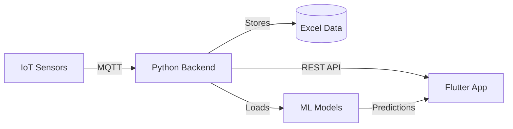
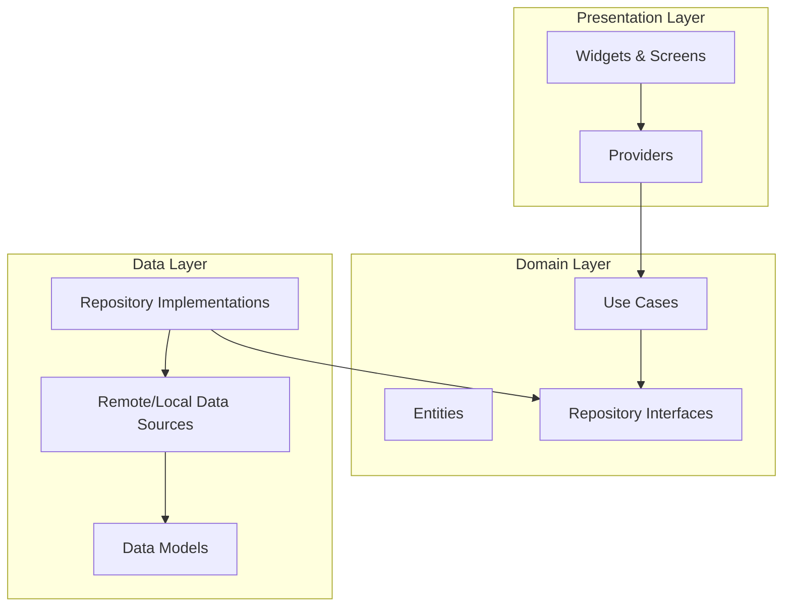
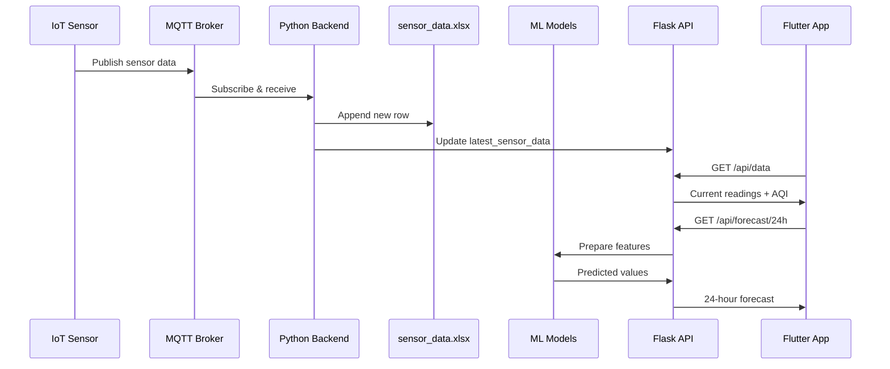

# Air Quality Guardian 🌬️

[](https://flutter.dev)
[](https://dart.dev)
[](https://python.org)
[](https://opensource.org/licenses/MIT)
[](http://makeapullrequest.com)

**Air Quality Guardian** is a cutting-edge, cross-platform mobile application that empowers users with **real-time air quality insights**, **personalized health recommendations**, and **AI-driven forecasts**. Built with **Flutter** and powered by **Machine Learning**, it bridges the gap between raw sensor data and actionable health protection.

---

## 🚀 Key Features

### 🌍 Real-Time Monitoring
*   **Live AQI Updates**: Instant access to Air Quality Index (AQI) data from IoT sensors via MQTT.
*   **Pollutant Breakdown**: Detailed analysis of PM2.5, PM10, CO2, TVOC, Temperature, and Humidity.
*   **Visual Gauges**: Easy-to-read gauges and color-coded indicators for quick assessment.
*   **Auto-Refresh**: Dashboard updates every 30 seconds automatically.

### 🏥 Personalized Health Protection
*   **Health Profiles**: Tailored alerts based on age, gender, and specific conditions (e.g., Asthma, COPD).
*   **Risk Assessment**: Dynamic risk calculation combining current AQI with user health data.
*   **Smart Suggestions**: Actionable advice like "Wear an N95 mask" or "Avoid outdoor exercise."

### 🔮 ML-Powered Forecasting
*   **Next-Hour Predictions**: Get predicted values for the next hour using Linear Regression models.
*   **24-Hour Forecast**: Hourly predictions for the next 24 hours.
*   **7-Day Forecast**: Daily average predictions for the next week.
*   **Trend Analysis**: See if air quality is improving, worsening, or stable.

### 🤖 AI Chat Assistant
*   **Forecast Queries**: Ask "What will AQI be tomorrow?" or "Show me the forecast"
*   **Health Queries**: "Is it safe to jog today?"
*   **Educational Info**: Learn about pollutants and their effects on health.
*   **Context Aware**: Understands your local air quality context.

### 🗺️ Interactive Maps
*   **Sensor Network**: Detailed map showing sensor locations and their real-time status.
*   **Heatmaps**: Visual representation of air quality distribution.

---

## 🏗️ Architecture

This project follows **Clean Architecture** principles with a **hybrid backend** approach:

### System Overview



### Flutter App Architecture



### Folder Structure
```
lib/
├── app/            # App configuration, routes, theme
├── core/           # Constants, utilities, exceptions, network config
├── data/           # Data layer (Models, API calls, Hive storage)
├── domain/         # Domain layer (Entities, UseCases, Repository Interfaces)
├── presentation/   # UI layer (Screens, Widgets, Providers)
├── services/       # Platform services (Location, Notifications)
└── main.dart       # Entry point

Backend/
├── mqtt_pipeline.py    # MQTT → Excel → Flask API
├── train_model.py      # ML model training script
├── models_lr/          # Trained ML models
├── sensor_data.xlsx    # Historical sensor data
└── am3.env            # MQTT credentials
```

---

## 🛠️ Tech Stack

### Mobile (Flutter)
*   **State Management**: `provider`
*   **Dependency Injection**: `get_it`
*   **Networking**: `dio` (with interceptors & error handling)
*   **Local Storage**: `hive`, `flutter_secure_storage`
*   **Maps**: `google_maps_flutter`
*   **Charts**: `fl_chart`
*   **Notifications**: `firebase_messaging`, `flutter_local_notifications`

### Backend (Python)
*   **MQTT Client**: `paho-mqtt` (real-time sensor data ingestion)
*   **API Framework**: `Flask` + `flask-cors`
*   **Data Storage**: `pandas` + Excel
*   **ML Framework**: `scikit-learn` (Linear Regression)
*   **Model Persistence**: `joblib`

### IoT Integration
*   **Protocol**: MQTT over TLS
*   **Broker**: The Things Network (TTN)
*   **Sensors**: Milesight AM308 (PM2.5, PM10, CO2, TVOC, Temp, Humidity)

---

## 📲 Getting Started

### Prerequisites

**Flutter App:**
*   Flutter SDK (3.0+)
*   Dart SDK (3.0+)
*   Google Maps API Key (optional, for maps feature)

**Python Backend:**
*   Python 3.10+
*   pip (Python package manager)

### Installation

#### 1. Clone the Repository
```bash
git clone https://github.com/widgetwalker/airsense5g.git
cd airsense5g
```

#### 2. Backend Setup

**Install Python Dependencies:**
```bash
pip install paho-mqtt pandas python-dotenv flask flask-cors scikit-learn joblib openpyxl
```

**Configure MQTT Credentials:**
Create `am3.env` file:
```env
MQTT_BROKER=your.mqtt.broker.com
MQTT_PORT=1883
MQTT_TOPIC=your/topic/path
MQTT_USERNAME=your_username
MQTT_PASSWORD=your_password
```

**Train ML Models (One-Time):**
```bash
python train_model.py
```
This creates `models_lr/` directory with 18 model files.

**Start Backend:**
```bash
python mqtt_pipeline.py
```
Backend runs on `http://localhost:5000`

#### 3. Flutter App Setup

**Install Dependencies:**
```bash
flutter pub get
```

**Run the App:**
```bash
flutter run
```

Choose your target device (Chrome, Edge, Windows, Android, iOS).

---

## 🚀 Usage

### Running the Complete System

**Step 1: Start Backend**
```bash
python mqtt_pipeline.py
```
✅ MQTT connected  
✅ Flask API running on port 5000  
✅ ML models loaded (if trained)

**Step 2: Run Flutter App**
```bash
flutter run
```

**Step 3: Use the App**
1. **Sign Up/Login** - Create your health profile
2. **Dashboard** - View real-time AQI and pollutant levels
3. **Chat** - Ask for forecasts:
   - "Show me the forecast"
   - "What will AQI be tomorrow?"
   - "Forecast for the week"
4. **Maps** - Explore sensor locations
5. **Forecast** - View detailed 24h/7-day predictions

---

## 🤖 ML Prediction System

### How It Works

1. **Data Collection**: MQTT sensors send data → Stored in `sensor_data.xlsx`
2. **Model Training**: `train_model.py` trains 6 separate Linear Regression models
3. **Feature Engineering**: Creates lag features and rolling averages
4. **Prediction**: Flask API serves predictions via 3 endpoints

### API Endpoints

| Endpoint | Description | Response |
|----------|-------------|----------|
| `GET /api/data` | Current sensor data + AQI | Latest readings |
| `GET /api/predict` | Next hour prediction | All pollutants predicted |
| `GET /api/forecast/24h` | 24-hour hourly forecast | 24 data points |
| `GET /api/forecast/week` | 7-day daily forecast | 7 daily averages |

### Retraining Models

As you collect more data, retrain for better accuracy:
```bash
python train_model.py
# Restart backend to load new models
python mqtt_pipeline.py
```

**Recommendation**: Retrain weekly or after collecting 50+ new data points.

---

## 📊 Data Flow



---

## 🔧 Configuration

### Environment Variables (am3.env)
```env
MQTT_BROKER=au1.cloud.thethings.industries
MQTT_PORT=1883
MQTT_TOPIC=v3/your-app@ttn/devices/+/up
MQTT_USERNAME=your-app@ttn
MQTT_PASSWORD=your-api-key
```

### Flutter Configuration
- **API Base URL**: Update in `lib/presentation/providers/dashboard_provider.dart`
- **Default**: `http://localhost:5000`
- **For Android Emulator**: Use `http://10.0.2.2:5000`

---

## 🐛 Troubleshooting

### Backend Issues

**"ML models not loaded"**
- Run `python train_model.py` first
- Check `models_lr/` directory exists

**"MQTT connection failed"**
- Verify credentials in `am3.env`
- Check broker URL and port

### Flutter Issues

**"Connection refused" in app**
- Ensure `mqtt_pipeline.py` is running
- Check API URL (use `10.0.2.2` for Android emulator)

**"Forecast unavailable"**
- Train ML models first
- Restart backend to load models

---

## 🤝 Contributing

Contributions are welcome! Please feel free to submit a Pull Request.

1. Fork the project
2. Create your feature branch (`git checkout -b feature/AmazingFeature`)
3. Commit your changes (`git commit -m 'Add some AmazingFeature'`)
4. Push to the branch (`git push origin feature/AmazingFeature`)
5. Open a Pull Request

---

## 📄 License

This project is licensed under the MIT License - see the [LICENSE](LICENSE) file for details.

---

## 🙏 Acknowledgments

- **The Things Network** for MQTT infrastructure
- **Milesight** for IoT sensors
- **Flutter** team for the amazing framework
- **scikit-learn** for ML capabilities

---

<p align="center">
  Built with ❤️ for a cleaner, healthier future.
</p>
