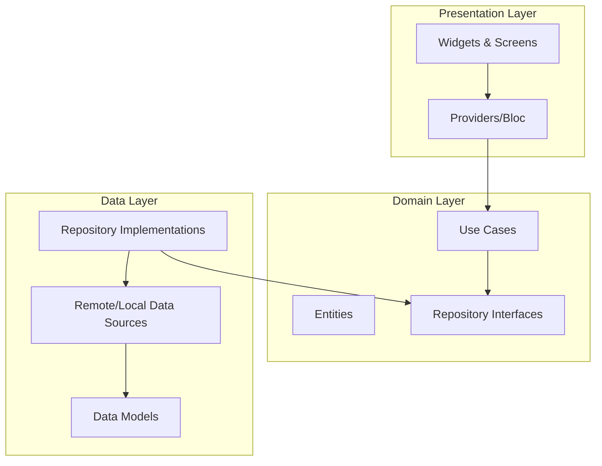

# Air Quality Guardian 🌬️

[](https://flutter.dev)
[](https://dart.dev)
[](https://opensource.org/licenses/MIT)
[](http://makeapullrequest.com)

**Air Quality Guardian** is a cutting-edge, cross-platform mobile application designed to empower users with real-time air quality insights, personalized health recommendations, and AI-driven forecasts. Built with **Flutter**, it bridges the gap between raw sensor data and actionable health protection.

---

## 🚀 Key Features

### 🌍 Real-Time Monitoring
*   **Live AQI Updates**: Instant access to Air Quality Index (AQI) data from IoT sensors.
*   **Pollutant Breakdown**: Detailed analysis of PM2.5, PM10, O3, NO2, SO2, and CO levels.
*   **Visual Gauges**: Easy-to-read gauges and color-coded indicators for quick assessment.

### 🏥 Personalized Health Protection
*   **Health Profiles**: Tailored alerts based on age, gender, and specific conditions (e.g., Asthma, COPD).
*   **Risk Assessment**: Dynamic risk calculation combining current AQI with user health data.
*   **Smart Suggestions**: Actionable advice like "Wear an N95 mask" or "Avoid outdoor exercise."

### 🔮 Intelligent Forecasting
*   **ML-Powered Predictions**: 24-hour and 7-day AQI forecasts powered by machine learning models.
*   **Activity Planner**: Best time suggestions for outdoor activities like jogging or playground visits.
*   **NLP Summaries**: Natural language descriptions of upcoming air quality trends.

### 🤖 AI Chat Assistant
*   **Health Queries**: Ask questions like "Is it safe to jog today?"
*   **Educational Info**: Learn about pollutants and their effects on health.
*   **Context Aware**: Helper that understands your local air quality context.

### 🗺️ Interactive Maps
*   **Sensor Network**: detailed map showing sensor locations and their real-time status.
*   **Heatmaps**: Visual representation of air quality distribution.

---

## 🏗️ Architecture

This project strictly follows **Clean Architecture** principles to ensure scalability, testability, and maintainability.



### Folder Structure
```
lib/
├── app/            # App configuration, routes, theme
├── core/           # Constants, utilities, exceptions, network config
├── data/           # Data layer (Models, API calls, Hive storage)
├── domain/         # Domain layer (Entities, UseCases, Repository Interfaces)
├── presentation/   # UI layer (Screens, Widgets, Providers)
├── services/       # Platform services (Location, Notifications)
└── main.dart       # Entry point
```

---

## 🛠️ Tech Stack

### Mobile (Flutter)
*   **State Management**: `provider`
*   **Dependency Injection**: `get_it`
*   **Networking**: `dio` (with interceptors & error handling)
*   **Local Storage**: `hive`, `flutter_secure_storage`
*   **Maps**: `google_maps_flutter`
*   **Charts**: `fl_chart`
*   **Notifications**: `firebase_messaging`, `flutter_local_notifications`

### Backend Services (Ecosystem)
*   **API**: Node.js + Express
*   **Database**: MongoDB
*   **ML/AI**: Python (FastAPI, XGBoost, Transformers)

---

## 📲 Getting Started

### Prerequisites
*   Flutter SDK (3.0+)
*   Dart PC SDK (3.0+)
*   Google Maps API Key
*   Firebase Configuration (for notifications)

### Installation

1.  **Clone the repository**
    ```bash
    git clone https://github.com/widgetwalker/airsense5g.git
    cd airsense5g
    ```

2.  **Install dependencies**
    ```bash
    flutter pub get
    ```

3.  **Code Generation** (for JSON serialization/Hive)
    ```bash
    flutter pub run build_runner build --delete-conflicting-outputs
    ```

4.  **Environment Setup**
    *   Add your Google Maps API key in `android/app/src/main/AndroidManifest.xml` and `ios/Runner/AppDelegate.swift`.
    *   Add `google-services.json` (Android) and `GoogleService-Info.plist` (iOS).

5.  **Run the App**
    ```bash
    flutter run
    ```

---

## 🤝 Contributing

Contributions are welcome! Please feel free to submit a Pull Request.

1.  Fork the project
2.  Create your feature branch (`git checkout -b feature/AmazingFeature`)
3.  Commit your changes (`git commit -m 'Add some AmazingFeature'`)
4.  Push to the branch (`git push origin feature/AmazingFeature`)
5.  Open a Pull Request

---

## 📄 License

This project is licensed under the MIT License - see the [LICENSE](LICENSE) file for details.

---

<p align="center">
  Built with ❤️ for a cleaner future.
</p>
